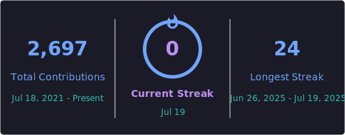

 

 

## About

Full-stack and mobile engineer in Okara, Pakistan. Freelancing since 2020; remote with US teams since 2023. BS Computer Science, University of Agriculture, Faisalabad (Jul 2026).

I build React and Next.js frontends, Node.js and Python backends, React Native apps, and the Docker / CI-CD side that keeps them alive in production. Auth, billing, Postgres, Redis. Whatever the product needs.

[zahidlatif.dev](https://zahidlatif.dev)

 

<table>
  <tr>
    <td width="25%" align="center">
      <h3>5+</h3>
      
Years in production

    </td>
    <td width="25%" align="center">
      <h3>8</h3>
      
Apps on Play Store &amp; App Store

    </td>
    <td width="25%" align="center">
      <h3>4.9</h3>
      
Fiverr · 49 reviews · Level 2

    </td>
    <td width="25%" align="center">
      <h3>~100</h3>
      
Freelance clients since 2020

    </td>
  </tr>
</table>

 

## Selected work

<table>
  <tr>
    <td width="50%" valign="top">
      <h3><a href="https://postbookingagent.com">Post Booking Agent</a></h3>
      
Automates Pakistan Post for ecommerce sellers: bookings, labels, COD money orders, tracking. Web app, React Native Android app, Shopify app. Runs on Docker on a VPS. My company.

      
<code>React</code> <code>Node.js</code> <code>React Native</code> <code>MySQL</code> <code>Shopify</code> <code>Docker</code>

      <a href="https://zahidlatif.dev/projects/post-booking-agent">Case study</a>
    </td>
    <td width="50%" valign="top">
      <h3><a href="https://tallify.ai">Tallify</a></h3>
      
AI bookkeeping and commission reconciliation for US insurance agencies. Plaid bank feeds, OCR receipts, AI categorization. Handles 50K+ transactions a month. Built at Xassure by eDesk.

      
<code>Next.js</code> <code>Node.js</code> <code>Python</code> <code>PostgreSQL</code> <code>Plaid</code> <code>Redis</code>

      <a href="https://zahidlatif.dev/projects/tallify">Case study</a>
    </td>
  </tr>
  <tr>
    <td width="50%" valign="top">
      <h3><a href="https://tryreceptionist.ai">Receptionist AI</a></h3>
      
No-code voice-AI calling: inbound and outbound, CRM, scheduling, telephony. Built during the Xassure by eDesk engagement. Separate product from Ayei.ai.

      
<code>Next.js</code> <code>Node.js</code> <code>Voice AI</code> <code>CRM</code>

      <a href="https://zahidlatif.dev/projects/receptionist-ai">Case study</a>
    </td>
    <td width="50%" valign="top">
      <h3><a href="https://xassure.ai">Xassure by eDesk</a></h3>
      
Sep 2023 – Mar 2026. Los Angeles, remote. VA ops for a 250+ person team, AI bookkeeping, voice AI, APIs at 10K+ requests/day, Stripe and PayPal, Docker and Kubernetes.

      
<code>React</code> <code>Next.js</code> <code>Node.js</code> <code>Python</code> <code>Supabase</code> <code>K8s</code>

      <a href="https://zahidlatif.dev/projects/xassure">Case study</a>
    </td>
  </tr>
</table>

  Also: <a href="https://ayei.ai">Ayei.ai</a> ·
  <a href="https://zahidlatif.dev/#projects">all case studies</a> ·
  <a href="https://zahidlatif.dev/#proof">Fiverr reviews</a>

 

## Tech stack

  
  
  
  

  
  
  
  

  
  
  
  
  

  
  
  
  
  
  

  
  
  
  
  
  

 

## GitHub

  
  

  

 

## Connect

  

Open to select freelance and contract work. Usually reply within a day.

